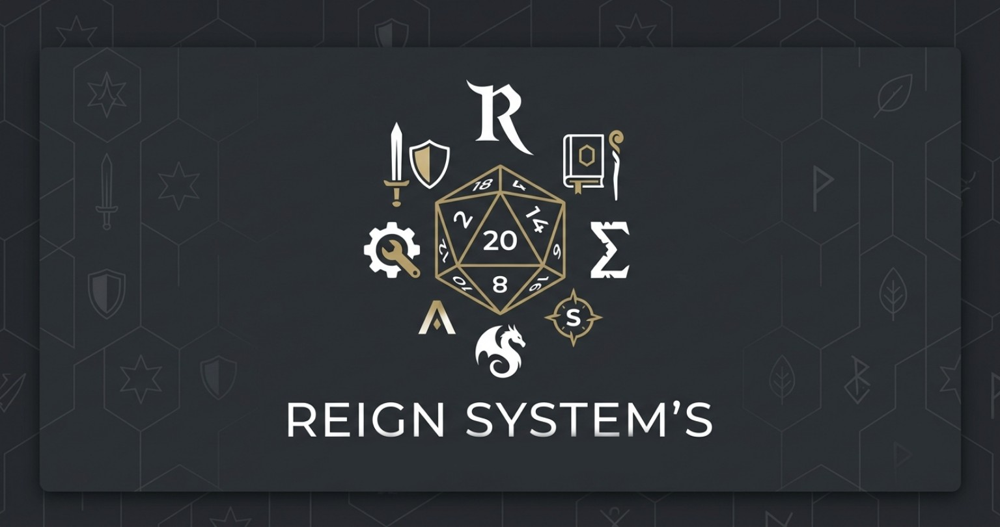

# 🎲 Reign System's

> Sua ferramenta definitiva para RPG de mesa — tudo em um só lugar, direto no navegador.

Site SPA (single page application) construído em **HTML, CSS e JavaScript puros**, sem frameworks e sem build step, pronto para rodar no GitHub Pages. Não há backend: todos os seus dados ficam salvos apenas no `localStorage` do navegador.

🔗 **Acesse ao vivo:** `https://github.com/MigueruYoutube/ReignSystems`

<p align="center">
  
</p>

## ✨ Funcionalidades

### 🎲 Rolagem de Dados
Expressões complexas como `1d20`, `4d6+8`, `2d20+3d6-5` ou `2d20*5`, com animação, histórico e um painel de estatísticas com "tendência lúdica" — puramente visual, a rolagem em si é sempre 100% aleatória e justa. Suporta até 500 dados por rolagem e 1.000.000 de lados por dado.

### 📖 Anotações
Um "livro digital" com sintaxe própria (estilo Discord): `# título`, `## subtítulo`, listas com `-`/`*`, cores customizadas (`$(255,0,0)texto`), caixas de "Anotação Importante" (`>texto`), `**negrito**`, `_itálico_`, `~riscado~` e destaque com busca lateral (`!texto!`). Aceita colar imagens direto da área de transferência ou por toque-e-segure.

### 🧙 Ficha de Personagem
Atributos 100% customizáveis, cada um com sua própria expressão de dados (ex.: `4d6+2`). Role um atributo por vez ou a ficha inteira, copie tudo para a área de transferência e salve quantos perfis quiser.

### 🧮 Calculadora
Operações padrão com histórico (data/hora de cada cálculo, reaproveitável com um toque), além de dois atalhos: **MÉDIA** de vários números e cálculo rápido de **%**.

### 🧑 Criador de NPCs
Gera NPCs completos por classificação: nome, aparência física, prompt em inglês pronto para IA de imagem, personalidade, modo de falar, pontos fortes e fraquezas. Copie o NPC inteiro ou salve-o na sua lista.

### 🛡️ Gerador de Itens
Itens por categoria e raridade, de **Comum** a **Mítico**. De Comum a Raro as passivas somam pontos fixos; de Épico a Mítico elas viram bônus percentuais, mais raros e poderosos.

### 💥 Sistema de Combate
Calculadora de dano completa: partes do corpo com multiplicadores somáveis (ou partes personalizadas), tipos de dano, um campo único de modificadores encadeados (`+10% +10 -5% +200% x2 ÷4`, sem limite prático) e divisores por contexto (Debuffado ÷10, Normal ÷8, Crítico ÷4, Real ÷10).

### ❤️ Status de NPCs/Players
Rastreador de HP e atributos para mais de mil fichas, em cards expansíveis — até 4 abertos lado a lado no desktop, tela cheia no celular. Cálculo de HP encadeado (pontos, %, multiplicação, divisão) e atributos personalizados livres por ficha.

### ⚙️ Configurações
Tema claro/escuro, som de interface, som ambiente com volume ajustável, e **backup completo**: exporte tudo (fichas, NPCs, itens, anotações, tracker) em um único JSON e importe em qualquer outro navegador ou dispositivo.

## 🛠️ Tecnologias

- HTML5 + CSS3 + JavaScript puro — sem frameworks, sem dependências de build
- Tipografia: **Cinzel** & **Marcellus** (títulos) + **Inter** (corpo), via Google Fonts
- Ícones: Font Awesome 6
- Som ambiente via Web Audio API
- Fundo animado com partículas em `<canvas>`
- Contador de visitas via FiniCounter
- Tema claro/escuro com variáveis CSS e unidades sempre relativas (responsivo)

## 🔒 Privacidade e dados

Não há servidor nem banco de dados externo. Tudo o que você cria — fichas, NPCs, itens, anotações, tracker e configurações — fica salvo apenas no `localStorage` do seu navegador, sob chaves prefixadas com `rpgSystem_`. Use **Exportar Backup** (em Configurações) sempre que for trocar de navegador ou dispositivo, para não perder nada.

## 🚀 Publicando no GitHub Pages

1. Crie um repositório novo no GitHub e envie estes arquivos mantendo a estrutura de pastas.
2. No repositório, vá em **Settings → Pages**.
3. Em "Source", selecione a branch `main` (ou `master`) e a pasta `/ (root)`.
4. Salve — em alguns minutos o site estará em `https://SEU_USUARIO.github.io/NOME_DO_REPO/`.

## 📁 Estrutura do projeto

```
index.html                estrutura de todas as páginas do SPA
style.css                 tema, layout e animações
assets/                    imagem de preview (og:image / card social)
audio/ambient-tavern.mp3   som ambiente opcional
js/
 ├─ core.js        storage, áudio, tema, roteador, partículas, contador de visitas
 ├─ data.js        bancos de nomes, aparências, personalidades e passivas
 ├─ dice.js        página de Rolagem de Dados
 ├─ sheets.js       página de Ficha de Personagem
 ├─ calculator.js  página de Calculadora
 ├─ npc.js         página de Criador de NPCs
 ├─ items.js       página de Gerador de Itens
 ├─ combat.js      página de Combate
 ├─ tracker.js     página de Status de NPCs/Players
 ├─ notes.js       página de Anotações
 └─ settings.js    página de Configurações
```

## 💬 Comunidade

Entre no Discord **Reign of Rpg's**: https://discord.gg/gTVPtYGnpt

## 📜 Créditos

© Todos os direitos reservados a **Miguel Kayky**
GitHub: https://github.com/MigueruYoutube
